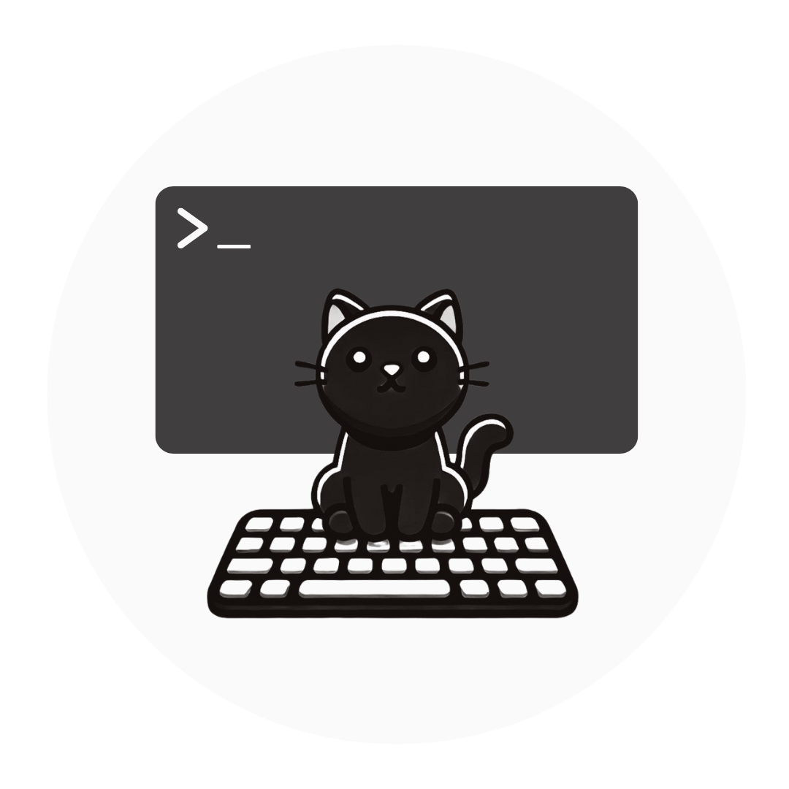

# CatCopilot

Welcome to **CatCopilot**! Think of this repository as your personal companion through the world of software engineering—brought to you by **Titus**, our resident feline mentor. Whether you’re just starting out or looking to sharpen your skills, you’ll find a range of starter projects, scripts, and templates here to help you build your next big idea.

## Repository Overview

- **[cloudformation](cloudformation/README.md)**  
  Templates and examples for AWS CloudFormation, enabling Infrastructure as Code (IaC) for scalable, reproducible environments.

- **[ci](ci/README.md)**  
  Continuous Integration (CI) examples and best practices, covering pipelines and automation tips.

- **[go](go/README.md)**  
  Starter projects and code snippets in Go (Golang). Ideal for back-end services, CLI tools, and more.

- **[ml](ml/README.md)**  
  Machine Learning resources, including sample notebooks, scripts, and frameworks for building ML solutions.

- **[node](node/README.md)**  
  Node.js templates and examples—perfect for building REST APIs, real-time applications, and more.

- **[python](python/README.md)**  
  Python starter projects and libraries, from quick scripts to web services and data processing pipelines.

- **[rust](rust/README.md)**  
  Rust examples focusing on performance, safety, and concurrency patterns.

- **[shell](shell/README.md)**  
  Handy shell scripts and automation techniques for improving development and ops workflows.

- **[terraform](terraform/README.md)**  
  Terraform modules and examples to help you manage infrastructure across multiple cloud providers.

- **[typescript](typescript/README.md)**  
  TypeScript codebases, front-end or back-end, showcasing static typing and advanced JavaScript tooling.

## How to Use This Repository

1. **Explore** the directories above to find sample projects or boilerplates related to your interests or technology stack.
2. **Clone** or **fork** the repo to start experimenting with the included templates.
3. **Read** each folder’s `README.md` to understand project setup, dependencies, and usage.
4. **Build**, **run**, or **deploy** your code as outlined in each subfolder.
5. **Customize** the templates for your own apps or services.

## Contributions & Feedback

- **Contributions**: Pull requests, bug reports, and feature requests are always welcome! Feel free to open an issue or submit a PR if you have improvements or new templates to share.
- **Feedback**: If you find something confusing or have a suggestion, let us know. We’re eager to make CatCopilot as helpful as possible.

## License

TBD 
---

**Happy coding**, and may Titus guide you through every commit and push! If you have questions, feel free to reach out via Issues or Discussions. We can’t wait to see what you build. 
